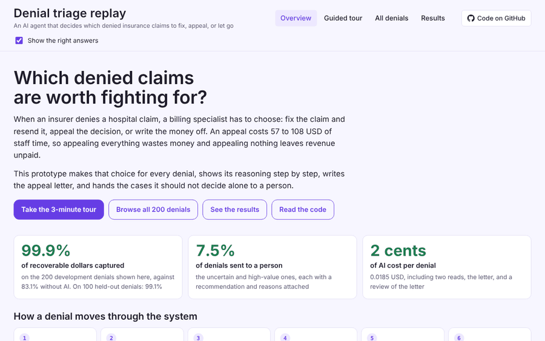

# Denial triage and appeal agent

An AI agent that works a queue of denied medical claims. It finds why each claim was denied, appeals only when the expected recovery is greater than the cost of the appeal, and drafts appeal letters in which every fact cites the source document. Quality is measured with evals on a frozen held-out set.


[Live demo](https://vikramsagi.github.io/denial-triage/demo/) · [Evaluation report](docs/eval-report.md) · [Design decisions](docs/adr/) · [Run it yourself](#run-it-yourself)

All data is synthetic. This project is not for clinical or billing use.

## Contents

- [The problem](#the-problem)
- [The solution](#the-solution)
  - [What it does](#what-it-does)
  - [Demo](#demo)
  - [How it works](#how-it-works)
  - [One denial, end to end](#one-denial-end-to-end)
  - [Results](#results)
- [Key decisions & Tradeoffs](#key-decisions--tradeoffs)
- [How quality was proven](#how-quality-was-proven)
- [After launch](#after-launch)
- [What did not work](#what-did-not-work)
- [What I would do differently](#what-i-would-do-differently)
- [Next steps](#next-steps)
- [Run it yourself](#run-it-yourself)
  - [Try it without spending anything](#try-it-without-spending-anything)
  - [Run it with your own API key](#run-it-with-your-own-api-key)
  - [Try your own models](#try-your-own-models)
  - [Reproduce my numbers](#reproduce-my-numbers)
- [Built with](#built-with)

## The problem

Insurers deny about 12% of hospital claims the first time they are sent, up from 9% in 2016 ([Optum 2024 Denials Index](https://marketplace.optum.com/content/dam/change-healthcare/marketplace-assets/outcomes-and-insights/2024-denials-index.pdf)). That is money the hospital earned for care it already gave. Hospitals spent an estimated 19.7 billion USD in 2022 fighting denials, and more than half of the denied claims were paid in the end ([Premier, via the AHA](https://www.aha.org/node/692934)). Many denials are wrong. Each one still takes work to reverse.

That work lands on a denial specialist in the billing team. For every denial in the queue they need three answers. Why was it denied? Is it worth more work? And if it is, should they fix the claim and send it again, or appeal with a letter?


A wrong call costs money either way. Appealing a claim that was never going to win wastes the appeal. Writing off a claim that would have won loses all of it. And a letter that gets one date or amount wrong gives the insurer an easy reason to say no. Cost sources are in the [data card](docs/data-card.md).

## The solution

### What it does

The specialist opens the queue and every denial already has a recommendation, with the reason written out.


- **Appeal.** The agent recommends an appeal only when the win odds times the amount beat the cost of appealing. The letter comes drafted. Each sentence cites the claim or a line in the records, and a checker blocks any sentence whose date, amount or code is not in the cited source.
- **Fix and resend.** It names the mistake to fix, such as a swapped digit in the member ID or an authorization number left off the claim.
- **Write off.** It says why nothing can be recovered, such as a claim sent after the filing window.
- **Needs a person.** Claims of 5,000 USD or more go to a person, and so do claims where two independent reads of the denial lead to different actions. These still carry the agent's suggestion and its reasoning, so the reviewer does not start from scratch.

Nothing goes to an insurer until a person approves it.

### Demo

**[Open the live demo](https://vikramsagi.github.io/denial-triage/demo/)**. It runs in the browser with no sign-in and no AI calls. It replays saved results for the 200 development denials.

[](https://vikramsagi.github.io/denial-triage/demo/)

Start with the guided tour. It walks through six cases, from a strong appeal to an attack hidden in the paperwork. You can replay any denial step by step and see the right answer next to what the system did.

### How it works


Simple rules go first, because some denials have a mechanical answer, such as a swapped digit in a member ID. On the 200 development denials, rules settled 57 of them at no cost. For the rest, Claude Haiku 4.5 reads the claim and its records twice, separately. If the two reads point to different actions, a person decides. The win odds come from past outcomes for the same denial reason, adjusted for how strong the evidence is. The system then picks the action worth the most after its cost.

Appeal letters get their own checks. Claude Sonnet 5.5 writes the letter. Plain code then confirms that every date, amount and code matches the record line it cites. Last, Claude Opus 5.5 grades it. A letter is marked ready only with 5 out of 5 for faithfulness to the record and at least 3 on every other score. The records themselves are treated as untrusted text, so an instruction hidden in a note cannot change what the agent does. Each choice here has a decision record in [docs/adr](docs/adr/).

### One denial, end to end

DN-56758 is a cardiology claim for 4,680.19 USD. The insurer denied it as not medically necessary.


No rule can settle a medical necessity denial, so the AI reads the record. Both reads found the same thing: the insurer's own policy asks for 6 weeks of conservative treatment first, and the clinical note documents 6 weeks. With evidence like that, the win-odds table puts an appeal at 70%, so it is worth about 3,170 USD after its cost. The letter makes that argument in four cited sentences and leaves out the two record lines that do not matter. It passed the citation check on the first try, and the judge gave it 5 out of 5 on all four scores. The AI cost for this denial was about 0.04 USD.

[Replay this denial step by step in the demo](https://vikramsagi.github.io/denial-triage/demo/#DN-56758).

### Results

These are the final scores on 100 held-out denials. I set them aside at the start and ran the system on them once, after every design choice was fixed.


**My call: ready for a supervised pilot, not for running on its own.** Before the test I set a strict rule: a target only counts if the low end of its 95% interval clears it. Six of seven targets pass. Appeal recall does not. It is 93.8% against a 90% target, but the interval drops to 83.9%.

The recall miss comes down to two claims out of 32 worth appealing. One was a near tie worth 13 USD. The other was a real mistake. Another insurer's coverage had ended, and the system read that as a patient ID problem. It wrote off a claim worth 976.69 USD. That one error is most of the 1,112.98 USD lost across all 100 claims.

In a pilot, a person would approve every write-off before it is final. On the dev set that is about 1 claim in 4, and it would have caught the costly miss. Recall still needs a fresh test set to settle, since the held-out set is now used up. More in [What did not work](#what-did-not-work).

## Key decisions & Tradeoffs

Six decisions shaped the system. For each one: what I rejected, the number that settled it, and what it gains and gives up, in both architecture and business terms. The two marked in focus mattered most.


Why Claude at all: it is what I use for my own work, so I built on it and compared the Claude models against each other. A judge from a different model family is on the list of things I would change.

Decision records, with every option and the full evidence: [small model reads](docs/adr/ADR-002-model-tiering.md) · [ask twice](docs/adr/ADR-004-two-read-agreement-check.md) · [letter judge](docs/adr/ADR-005-letter-judge.md) · [rules read formats](docs/adr/ADR-001-rules-first-then-model.md) · [citation check](docs/adr/ADR-003-grounded-drafting.md) · [monitoring and feedback](docs/adr/ADR-006-monitoring-and-feedback.md)

## How quality was proven


- **A test set I could not tune on.** I split off 100 denials at the start, written with phrasings the system never saw while I built it. I opened them once, at the end, and the run is logged. Development and held-out results agree closely (99.9% and 99.1% of value captured), so the build did not overfit.
- **Baselines without AI.** Every result is compared with three approaches that use no AI: appeal every claim above 500 USD, look up the reason code, and the same rules and dollar routing without a model. The best of them captured 82.5% on held-out.
- **Ranges on every number.** Every headline number has a 95% interval from 2,000 bootstrap resamples, and the pass rule was fixed before the test.
- **Metrics that can fail.** Before a metric went into a report, I broke the system on purpose and checked that the metric got worse. Always writing off drops value captured to 0%. Shuffling root causes drops root-cause accuracy from 82.5% to 13%.
- **Letters checked twice.** Code checks every citation in every letter. A second model grades each letter, and it had to fail 5 planted bad letters and ignore padding before I trusted it.
- **Repeat runs.** Across three runs of an earlier prompt, 96% of denials got the same route each time. The two-read check exists because of the other 4%.
- **A regression suite.** 20 golden denials are replayed from saved answers on every test run, with no model calls, so a change that moves a route or a dollar value fails the build. All 93 tests run for free.

The full method and every run file are in the [evaluation report](docs/eval-report.md).

## After launch

A system that passes its test can still fail the week after it ships, when a payer changes its rules. So I simulated that week. 150 new denials arrive, and one payer, Northwind Health Plan, tightens prior authorization. Prior authorization denials rise from 13% to 31% of the queue. Northwind's notes use wording the system has never seen, and its appeals win about a fifth as often. The week was never used to tune anything.


**Monitoring.** In production there are no right answers, so the monitor only compares the system's own decisions with a known-good baseline. It raised a warning on the denial reasons, at 0.226 against an alert line of 0.25. Route mix, confidence, cost and the share sent to a person all stayed in their bands, because the system kept working normally on the new wording. On a rerun of the development set it stayed quiet. I set the thresholds before the test week and did not move them afterwards, which is why the result is a warning and not an alert.


**Feedback.** Appeal outcomes from the first three days go back into the win odds, one payer and denial reason at a time. Northwind's prior authorization appeals won 1 of 7, against 3.82 expected, so their odds were cut to 0.53 times the old value. The raw ratio would have been 0.26, but a few outcomes should not swing the odds that far. On days 4 to 7, money lost fell from 211 to 147 USD.

The gain is small and the ranges overlap. Most of the affected claims were still worth appealing at the lower odds. What the week shows is that the mechanism works: the change was seen without right answers, and the correction moved the right way from seven outcomes. [Decision record](docs/adr/ADR-006-monitoring-and-feedback.md).

## What did not work


- **One misread caused most of the loss.** On DN-54296, the denial said another insurer's coverage had ended. The system read it as a patient ID error, and both reads led to a write-off, so 976.69 USD was lost. Because the reads agreed, the two-read check could not catch it. The fix I would test is a check for other-insurance wording before any registration write-off, or better, a structured eligibility lookup. Either one needs fresh claims to test on, because the held-out set is used up.
- **The judge holds back some good letters.** It cleared 22 of 25 strong-case letters on held-out. It is strict about wording, for example flagging "rendering provider" when the source only says "provider". No wrong letter goes out because of it, but each one costs a review, and at scale that adds up.
- **The attack tests are small.** 18 planted prompt injections across development and held-out, and none worked. That sets a bound. It does not prove the system is safe against a determined attacker.
- **The simulated week is still a simulation.** Appeal outcomes were drawn from the answer key's win odds, standing in for a real outcome feed. The loop has not met real payer behavior yet.

## What I would do differently

- **Improve the evals.** I would have a billing specialist grade about 20 letters and compare their grades with the judge's. I would also pick the judge from a different model family. Here Claude Opus grades letters written by Claude Sonnet, and models from the same family can favor writing that sounds like their own. A judge from another family, checked against a specialist, would be better calibrated. And I would size the test set together with the targets: with 32 claims worth appealing, a 90% recall target could only be shown with at most one miss.
- **Make a write-off the hardest action to take.** A write-off cannot be undone, yet the system takes it as easily as any other action, and the costliest held-out miss was one. I would put a check in front of every write-off, and ask for stronger evidence before the system recommends one.

## Next steps

In the order I would do them, with the reason for each.

- [ ] **Make a write-off the hardest action to take.** A write-off cannot be undone, and the costliest miss was one. Every write-off would need stronger evidence than other actions, plus a check before it is final.
- [ ] **Add an eligibility lookup for other insurance.** The costliest miss came from reading coverage status out of a note. Structured eligibility data would answer that question directly.
- [ ] **Look up payer policy by payer, procedure code and service date.** Policies change often. Fetching the version in force on the date of service is how billing teams work, and it would show policy changes to the monitor directly.
- [ ] **Calibrate the judge.** Collect grades from a billing specialist and test a judge from a different model family against them.
- [ ] **Build a larger, fresh test set.** The held-out set is used up. A new one from a different generator, sized from the recall target, would settle appeal recall.

## Run it yourself

You need Python 3.12 and [uv](https://docs.astral.sh/uv/). You do not need an API key to look around. Without one, the system runs in mock mode with a fake model and spends nothing.

```bash
git clone https://github.com/vikramsagi/denial-triage.git
cd denial-triage
uv sync
uv run pytest -q    # 93 tests, all in mock mode, no API calls
```

### Try it without spending anything

```bash
uv run python -m evals.run_eval --split dev --config b2_rules_ev                    # best approach without AI
TRIAGE_MOCK=1 uv run python -m evals.run_eval --split dev --config m_rules_small_think_x2   # full pipeline, fake model
uv run python -m evals.export_demo                                                  # rebuild the demo page from saved results
```

The mock model gives fixed answers, so its scores mean nothing. It shows every stage running end to end. On Windows PowerShell, set the variable with `$env:TRIAGE_MOCK=1` first.

### Run it with your own API key

```bash
cp .env.example .env    # then put your key after ANTHROPIC_API_KEY=
uv run python -m evals.run_eval --split dev --config m_rules_small_think_x2 --with-letters
uv run python -m triage.budget    # what you have spent so far
```

Every call goes through a spending ledger that refuses calls past a cap of 40 USD. Change `BUDGET_CAP_USD` in `triage/config.py` to set your own. Rough costs: about 2.10 USD to classify all 200 development denials with two reads, about 3.70 USD with letters and grading, and about 1.60 USD for the simulated week.

### Try your own models

Model IDs and prices live in one place, `MODELS` in [`triage/config.py`](triage/config.py), in three tiers: `small` reads denials, `large` writes letters, and `judge` grades them. Change an ID and its prices, then rerun the evals and compare your run file with mine. Every call goes through [`triage/llm.py`](triage/llm.py), which uses the Anthropic SDK. To try another provider, that one file is where it would plug in.

### Reproduce my numbers

Every number in this README comes from a saved run file in [`evals/runs`](evals/runs).

| Result | Command |
| --- | --- |
| Final system on development | `uv run python -m evals.run_eval --split dev --config m_rules_small_think_x2 --with-letters` |
| Baselines without AI | `uv run python -m evals.run_eval --split dev --config b0_appeal_above_500` (also `b1_reason_code`, `b2_rules_ev`) |
| Simulated week | `uv run python -m evals.run_week` |
| Held-out score | `uv run python -m evals.run_eval --split heldout --config m_rules_small_think_x2 --with-letters` |

Model answers vary a little between runs, so expect small differences from the saved numbers. I ran the held-out split once. On your copy you can run it too, but treat it as the final test and do not tune on it.

## Built with

- **Models:** Claude Haiku 4.5 with extended thinking reads denials, Claude Sonnet 5.5 writes letters, and Claude Opus 5.5 grades them through the Message Batches API.
- **Code:** Python 3.12, the Anthropic Python SDK, pydantic, pytest and uv.
- **Demo:** a single static page on GitHub Pages, built from saved results.
- **Data:** 450 synthetic denials from a seeded generator: 200 for development, 100 held out and 150 for the simulated week. See the [data card](docs/data-card.md).

More detail: [brief](docs/brief.md) · [evaluation report](docs/eval-report.md) · [assumptions](docs/assumptions.md) · [decision records](docs/adr/)

---

Built by Vikram Sagi · [LinkedIn](https://www.linkedin.com/in/vikramsagi1)
